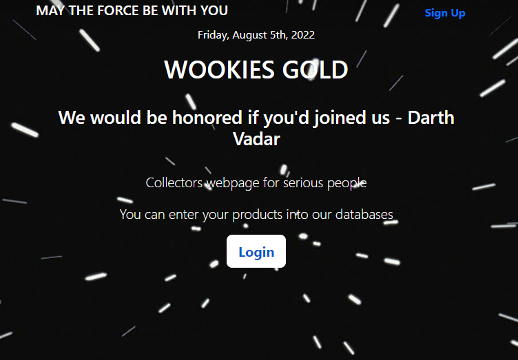
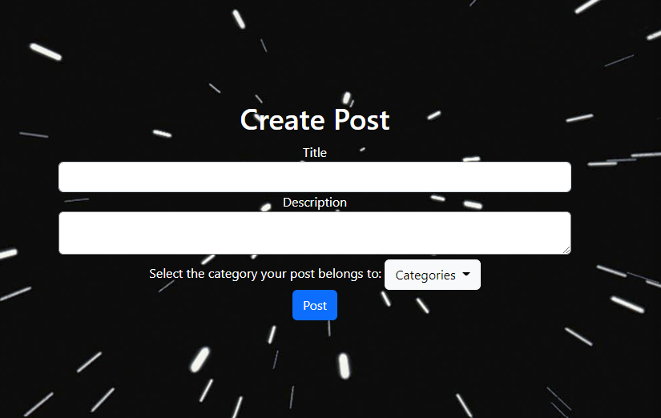
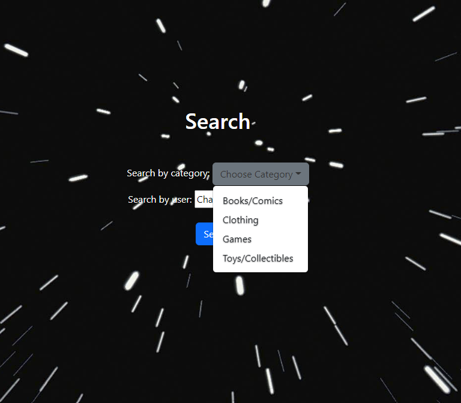
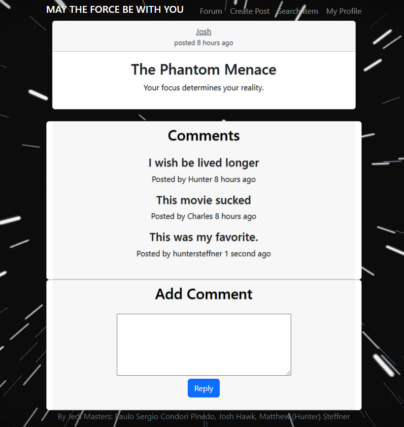

# Message-Forum

## Table of Contents

- [Message-Forum](#message-forum)
  - [Table of Contents](#table-of-contents)
  - [Description](#description)
  - [Installation](#installation)
  - [Usage](#usage)
  - [Screenshots](#screenshots)
    - [Landing Page](#landing-page)
    - [Forum Page](#forum-page)
    - [Create Post Page](#create-post-page)
    - [Search Page](#search-page)
    - [Comments Page](#comments-page)
  - [License](#license)
  - [Future developments](#future-developments)

## Description

This website is designed with Collectors of Star Wars Merchandise in mind. It servers a central forum and hub where users can communicate to create posts for various Star Wars collectibles to share. Users can register a profile with the website, make posts, reply on existing hosts, and use the search feature to find items by category.

## Installation

This program requires Node.js and NPM. Once these are installed, please run:

```
npm init
```
and then
```
npm i
```

## Usage

When the user accesses the website he/she is taken to a landing page with a Login Button. The member can follow this link and then is prompted to either login or create a new username. Once the user is logged in, either as a returning user or by registering for the first time, he/she can then browse all the posts of various Star Wars Collectibles. Each post is given a specific category, so the search feature in the main nav bar can be employeed to search by Category and Username.

## Screenshots

### Landing Page


### Forum Page


### Create Post Page


### Search Page


### Comments Page


## License
MIT

## Future developments

Add functionality to post images for profile pictures and posts of items

Ability to make purchases on website

Ability to make DMs to other users

Notifications when people comments on posts
Links to external sources to make purchases.

